# Deep Dueling On-Policy Learning

In Intelligent Transportation Systems (ITS), Deep Reinforcement Learning (DRL) is being rapidly adopted in many complex environments due to its ability to leverage neural networks to learn good strategies. A centralized TSC controller with a deep RL agent (DRL-agent) is trained by a novel [deep dueling on-policy learning method]() referred to as 2DSARSA.

<p align="center">
  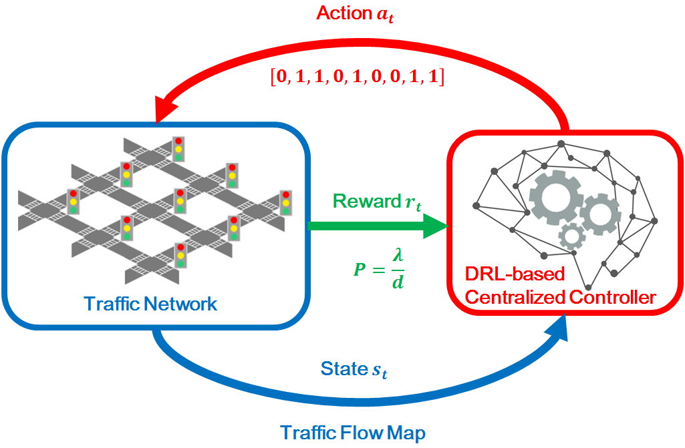
</p>


## Motivation

In Traffic Signal Control (TSC), existing work has focused on off-policy learning (Q-learning) with neural networks. There is insufficient study on the comparison between deep on-policy (DSARSA) and deep off-policy (DQN) in the context of TSC. This work is a first step towards addressing this gap for TSC researchers. Our preliminary work have shown that DQN and 3DQN perform unstably in a complex environment when the action space is extremely large. To address this issue, we propose the deep dueling on-policy learning algorithm, which is a new algorithm leveraging visualized inputs capturing flow dynamics, power metric based reward function, and several DRL related techniques. The proposed algorithm achieves a better learning performance in a large action space compared to well-known DRL algorithms
 

## The Proposed DRL Agent

* Deep Dueling SARSA (2DSARSA) ([code](./code), [paper]())

<p align="center">
  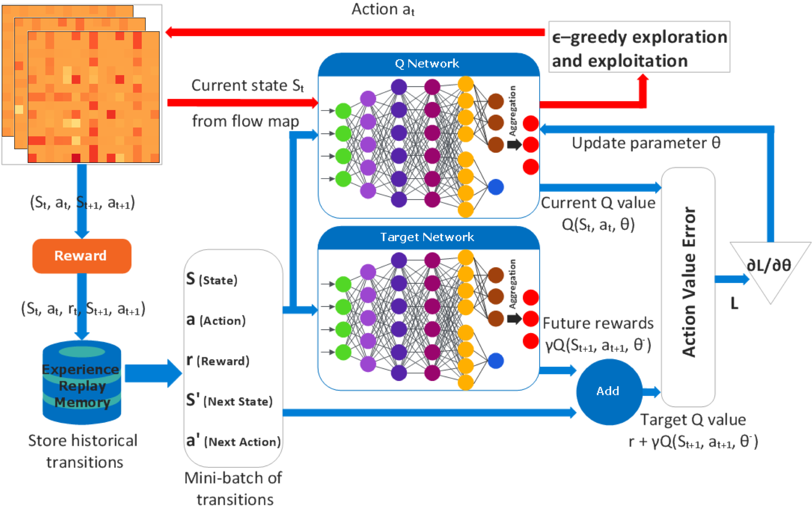
</p>

Deep Dueling SARSA (2DSARSA) is a novel deep reinforcement learning algorithm based on the incorporation of the proposed [traffic flow maps]() and [power metric based reward function]() into the [Deep On-Policy Learning (SARSA)](https://ieeexplore.ieee.org/abstract/document/7849837) algorithm, as well as applying [Dueling Network Architectures](https://arxiv.org/abs/1511.06581) and [Experience Replay Memory](https://www.nature.com/articles/nature14236?wm=book_wap_0005). 


## Traffic Flow Maps (TFMs)

To describe the states of the environment, we propose traffic flow maps (TFMs) that capture head-of-the-line (HOL) sojourn times for traffic lanes and HOL differences for adjacent intersections.

<p align="center">
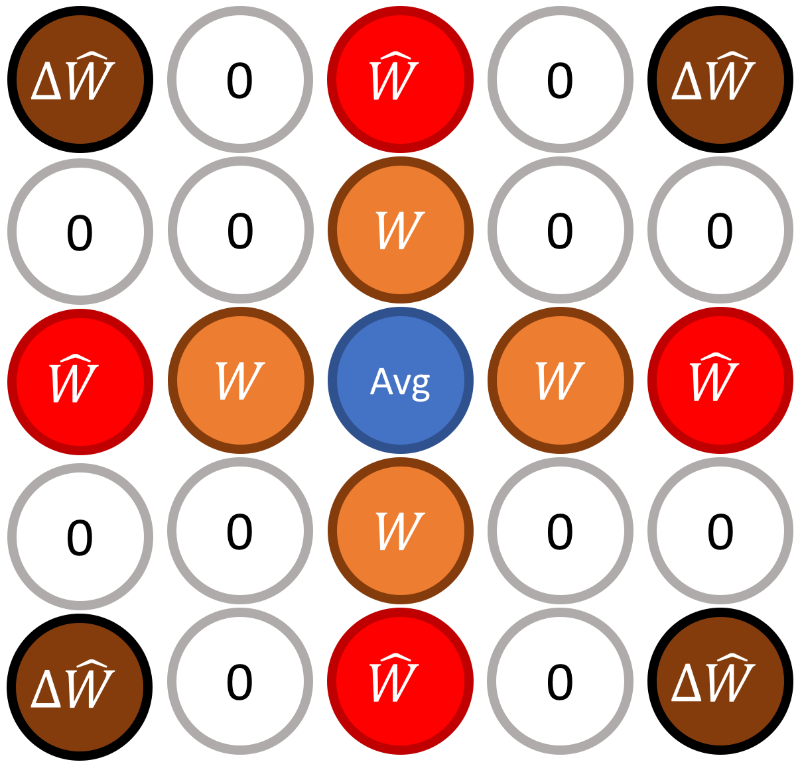 
<br>
<br>
<br>
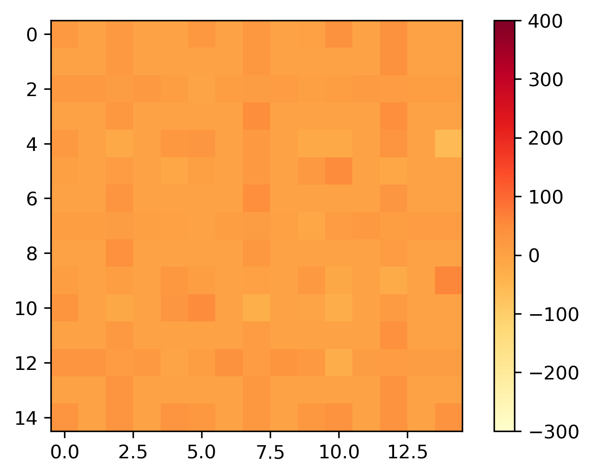 
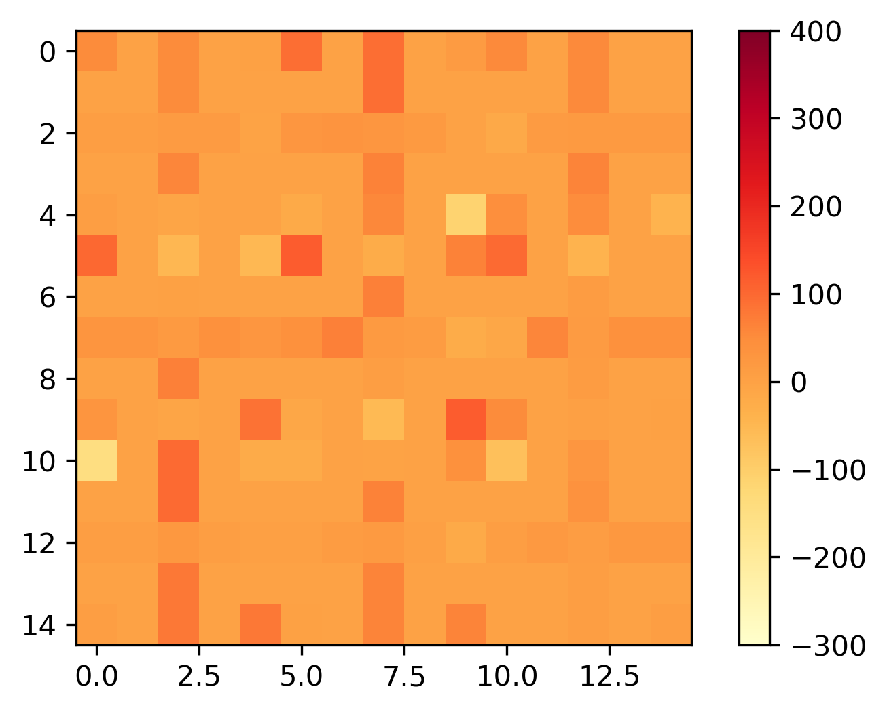 
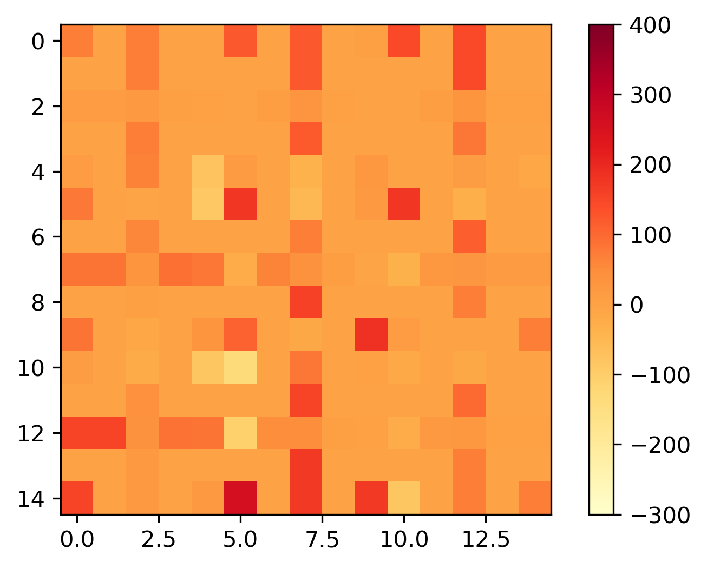 
</p>

## Power Metric based Reward Function

We introduce a reward function defined by the power metric which is the ratio of the network throughput to the average end-to-end delay. The proposed reward function simultaneously maximizes the network throughput and minimizes the average end-to-end delay.

<p align="center">
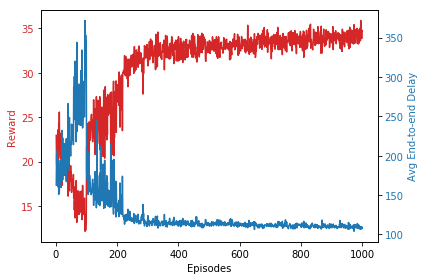 
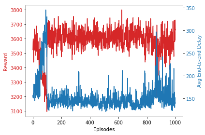 
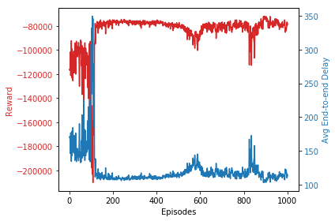 
<br>
<br>
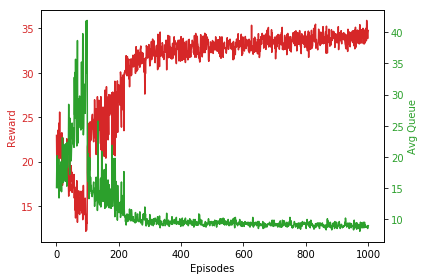 
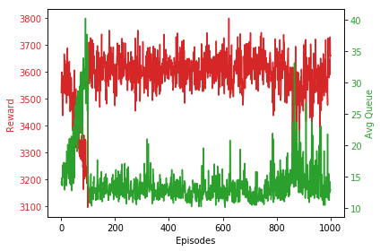 
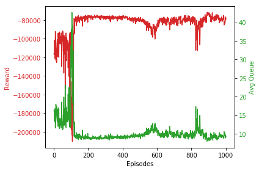 
</p>

## Learning Performance of The Proposed 2DSARSA

The 2DSARSA agent is able to perform remarkably well in a complicated traffic network of multiple intersections in our [work](). We have shown that the proposed 2DSARSA architecture has a significantly better learning performance compared to other DRL architectures including [Deep Q-Network (DQN)](https://www.nature.com/articles/nature14236), [3DQN](https://ieeexplore.ieee.org/document/8600382) and [Deep SARSA (DSARSA)](https://ieeexplore.ieee.org/abstract/document/7849837).

<p align="center">
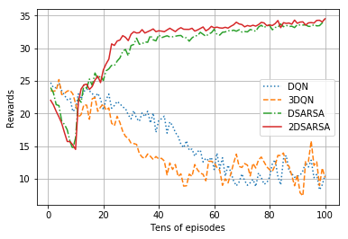 
</p>


## Environment Settings

* Set up your platform before running the code

### Install Miniconda
```bash
wget https://repo.anaconda.com/miniconda/Miniconda3-latest-Linux-x86_64.sh
sha256sum Miniconda3-latest-Linux-x86_64.sh or sha256sum Miniconda2-latest-Linux-x86_64.sh
bash Miniconda3-latest-Linux-x86_64.sh
``` 

### Conda Create Environment
```bash
conda create --name env_name
conda activate env_name
``` 

### Install Tools

Add channel conda-forge
```bash
conda config --add channels conda-forge
``` 
Add channel pytorch
```bash
conda config --add channels pytorch
``` 

Install numpy
```bash
conda install numpy
``` 

Install pytorch with a specific version
```bash
conda install pytorch torchvision cudatoolkit=10.2 -c pytorch
``` 

Install matplotlib
```bash
conda install matplotlib
``` 

Install scipy
```bash
conda install scipy
``` 

Install python-utils
```bash
conda install python-utils
``` 

Install utils
```bash
pip install utils
``` 

Install gym
```bash
pip install gym
``` 

Install ipython
```bash
conda install ipython
``` 

Install opencv
```bash
conda install opencv
``` 

Install opencv-python
```bash
pip install opencv-python
``` 

## Getting Started

You can clone this repository by:
```bash
git clone https://github.com/colouryen/2DSARSA.git
``` 

Switch to the code folder
```bash
cd 2DSARSA/code
``` 

Run the code
```bash
python RL_comp_multi.py
``` 

### Train a Model

You can readily train a new model for a traffic network of 9 intersections by running the [RL_comp_multi.py](./code/RL_comp_multi.py) script from the agent's main directory. 


### Save Model 

You can save a trained model in the ```saved_agents``` folder after running the [RL_comp_multi.py](./code/RL_comp_multi.py) script from the main folder.


## Citation

If you find this open-source release useful, please reference in your paper:

```
@inproceedings{yen2020deep,
  title={A Deep On-Policy Learning Agent for Traffic Signal Control of Multiple Intersections},
  author={Yen, Chia-Cheng and Ghosal, Dipak and Zhang, Michael and Chuah, Chen-Nee},
  booktitle={2020 IEEE Intelligent Transportation Systems Conference (ITSC)},
  pages={--},
  year={2020},
  organization={IEEE}
}
```
